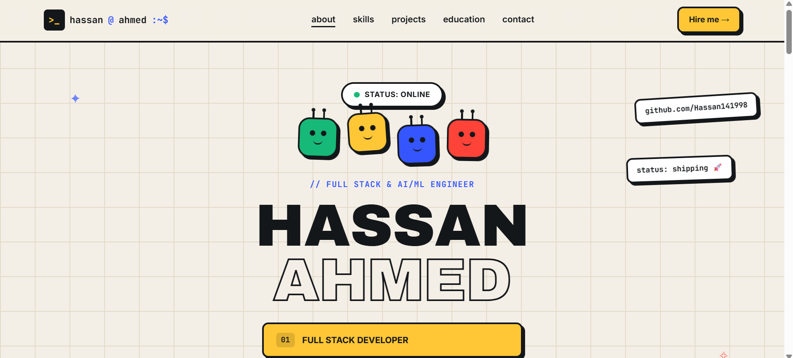

# Hassan Ahmed — Portfolio

Personal portfolio site for **Hassan Ahmed**, Full Stack Developer & AI/ML Engineer.
A neo-brutalist, single-scroll site with a graph-paper background, floating cartoon
mascots, and project cards pulled straight from [github.com/Hassan141998](https://github.com/Hassan141998).

**Live site:** _add your Vercel URL here after deploying_



---

## ✨ Features

- Bold neo-brutalist design — thick black borders, hard drop shadows, graph-paper grid background
- Animated floating "cartoon" mascots in the hero section
- Terminal-style `$ whoami` about card
- Animated stats counters (projects shipped, technologies used, etc.)
- Skills grouped by category + animated proficiency bars
- "Journey" timeline (2023 → now)
- Project cards with live demo + GitHub links, pulled from real repos:
  - **InsureCalc** — medical insurance cost predictor (R² 99.3%)
  - **CardioScan** — heart attack risk prediction (AUC ~94%)
  - **GlucoseGuard** — diabetes risk classification (AUC ~83%)
  - **Chinook Analytics** — SQL business intelligence dashboard
  - **SEMS** — IoT smart energy management system
  - **Face Recognition Attendance** — real-time computer vision attendance system
- Working contact form (opens the visitor's email client with the message pre-filled)
- Downloadable resume PDF (`resume.pdf`, plus `build_resume.py` to regenerate it)
- Mobile hamburger menu with slide-down panel
- Scroll-reveal animations on every section
- Back-to-top button
- Fully responsive, no build tools or frameworks required
- Includes a one-click Python launcher (`run.py`) for running locally in PyCharm

## 🛠 Tech stack

Plain **HTML5**, **CSS3**, and vanilla **JavaScript** — no frameworks, no build step.
Fonts via Google Fonts (Archivo Black, Space Grotesk, Inter, JetBrains Mono).
`resume.pdf` is generated with Python + reportlab (`build_resume.py`).

## 📁 Project structure

```
.
├── index.html        # Page structure & content
├── style.css         # Neo-brutalist design system & animations
├── script.js         # Nav highlight, hamburger menu, scroll reveal,
│                      # stat counters, skill bars, contact form, back-to-top
├── run.py             # Local dev server launcher (for PyCharm / any Python 3)
├── resume.pdf          # Downloadable CV (linked from the nav + hero)
├── build_resume.py     # Regenerates resume.pdf — edit this to update your CV
└── assets/
    └── preview.png    # Screenshot used above
```

## 🚀 Running locally

**Option A — Python (recommended, works in PyCharm):**

```bash
python run.py
```

This starts a local server and opens the site in your browser automatically.

**Option B — just open the file:**

Double-click `index.html`, or open it directly in your browser.

## ☁️ Deploying to Vercel

1. Push this repo to GitHub.
2. Go to [vercel.com/new](https://vercel.com/new) and import the repo.
3. Framework preset: **Other** (it's static HTML — no build command needed).
4. Click **Deploy**.

Vercel will auto-redeploy on every push to `main`.

## 📬 Contact

- Email: hani141998@gmail.com
- GitHub: [github.com/Hassan141998](https://github.com/Hassan141998)
- LinkedIn: [hassan-ahmed](https://www.linkedin.com/in/hassan-ahmed-98304030a/)
- Upwork: [profile](https://www.upwork.com/freelancers/~01b4e707d482637081)
